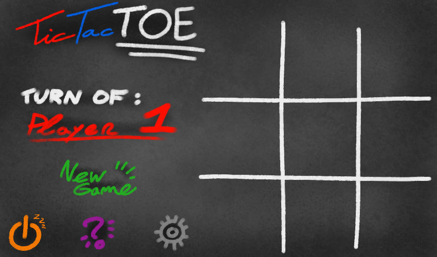
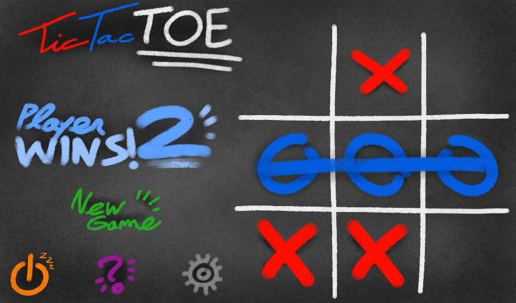

# TicTacToe

TicTacToe is a simple tictactoe game created with Raylib library. I've created this for school purposes, so maybe the software is not perfect.

[]

## Description

TicTacToe is a simple tictactoe game created with Raylib library. I've created this for school purposes, so maybe the software is not perfect. I wrote basic classes to use Raylib functions for a "OOP" view; these are in `src/base` folder. These classes can also be used for other projects.

## Dependencies

* Raylib

## Compiling

TicTacToe only uses Raylib library; this library supports multiple platform (Window, GNU/Linux, Mac and others), but I've created a Makefile that works only on GNU/Linux (because I'm learning to create it); thus TicTacToe works with all platform, but for now it works only on GNU/Linux.

### Install Raylib library
Now I show you how to install Raylib library. If you know how, skip this paragraph.
The Raylib library uses other libraries, so first you have to install them. If you are on Ubuntu/Debian, you can install the majority of them using this command:

    sudo apt install mesa-common-dev-dev libx11 libxrandr libXi-dev-dev xorg-dev libgl1-mesa-dev libglu1-mesa-dev freeglut3-dev
    
There is the last dependency (GLFW3):
    
    git clone https://github.com/glfw/glfw.git glfw
    cd glfw
    cmake .
    sudo make install
    
Then, you have to make the Raylib library:

    git clone https://github.com/raysan5/raylib.git raylib
    cd raylib/src/
    make
    sudo cp libraylib.a usr/local/lib/libraylib.a
    sudo cp raylib.h usr/local/include/raylib/raylib.h

Now you can use Raylib on your projects!

### Compiling TicTacToe

You can simply compile the software with `make`. It produces an executable, you can move it everywhere **BUT** he goes along with the `resources` folder!

You can also use `make clean` to clean the folder.

## Play

[]
[]

### How to play
Use your **mouse** to place marks on the grid. After a game, you can restart clicking on the "New Game" button. There is also the quit and help button.

You can start the software in a CLI with the `--help` or `--version` parameter.

## Known bugs

* When you move the mouse and keep pressed the left mouse button on the grid, the marks are placed.

## Contact

For bugs report, advice or feedbacks please send an email to *emanuele98(at)openmailbox(dot)org*.

## Contributors

* Leandro Rolih for graphics elements.

## License

The software is licensed under the [MIT license](https://opensource.org/licenses/MIT), while the graphic elements are distribuited under [CC BY-SA 4.0](https://creativecommons.org/licenses/by-sa/4.0/). Please view LICENSE file for further information.
