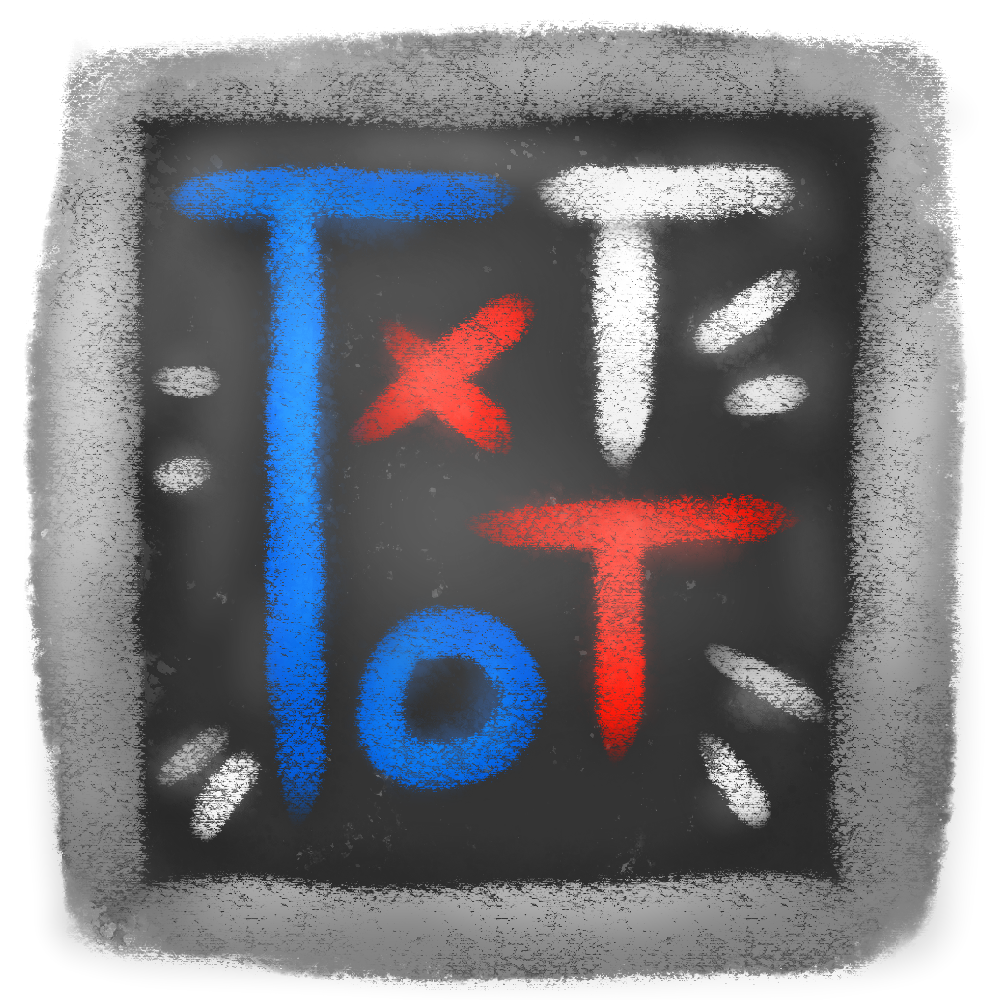

# TicTacToe

TicTacToe is a simple tictactoe game created with Raylib library. I've created this for school purposes, so maybe the software is not perfect.

## Description

TicTacToe is a simple tictactoe game created with Raylib library. I've created this for school purposes, so maybe the software is not perfect. I wrote basic classes to use Raylib functions for a "OOP" view; these are in `src/base` folder. These classes can also be used for other projects.

I'm not english, so there are lots of errors! You can help me to fix these!

## Dependence

* Raylib (1.3 version, 1.4 it's not tested).

## Build

TicTacToe only uses Raylib library; this library supports multiple platform (Window, GNU/Linux, Mac and others), but I've created a Makefile that works only on GNU/Linux (because I'm learning to create it); thus TicTacToe works with all platforms, but for now it works only on GNU/Linux. If you want to help me, write me!

### Build Raylib library
Now I show you how to install Raylib library. If you know how, skip this paragraph.
The Raylib library uses other libraries, so first you have to install them. I use Ubuntu, so you can install the majority of them using this command (it works with all OS that use APT):

    sudo apt install mesa-common-dev-dev libx11 libxrandr libXi-dev-dev xorg-dev libgl1-mesa-dev libglu1-mesa-dev freeglut3-dev
    
There is the last dependency (GLFW3); you need also cmake:
    
    git clone https://github.com/glfw/glfw.git glfw
    cd glfw
    cmake .
    sudo make install
    
Now, you can install Raylib library. You can build it with theese commands:

    git clone https://github.com/raysan5/raylib.git raylib
    cd raylib/src/
    make
    sudo cp libraylib.a /usr/local/lib/libraylib.a
    sudo cp raylib.h /usr/local/include/raylib/raylib.h

Now you can use Raylib on your projects!

### Build TicTacToe

You can simply compile the software with `make`. It produces an executable, you can move it everywhere **BUT** he goes along with the `resources` folder!

You can also use `make clean` to clean the folder.

## Play

### How to play
You can use the **left mouse button** to place marks on the grid. After a game, you can restart clicking on the "New Game" button. There is also the quit and help button.

You can start the software in a CLI with the `--help` or `--version` parameter, that provides some useful information.

## Known bugs

*No bugs? Really?*

## To do list

I'm really busy with the school, but if I can, i would like to add these things:
* Update the project to Raylib 1.4; [must, technological]
* Improve makefile to support more platforms; [must, technological]
* Add a very simple AI (so also add a settings window); [should, functional]
* Add the support of arrow keys (thus also enter button); [should, functional]
* Add a very basis animation for graphic elements. [should, not functional]

## Contact

For bugs report, advice or feedbacks please send an email to *emanuele98(at)openmailbox(dot)org*, or contact me with Telegram (my nickname is [**LelixSuper**](http://telegram.me/LelixSuper)).

## Contributors

* [Leandro Rolih](http://ilresanmto.deviantart.com/) for creating graphics elements.
* [Domenico Verde](https://github.com/LordRibblesdale) for translating the entire project.

## License

The software is relased under the [MIT license](https://opensource.org/licenses/MIT), while the graphic elements are distribuited under [CC BY-SA 4.0](https://creativecommons.org/licenses/by-sa/4.0/). Please view "LICENSE" file for more information.
